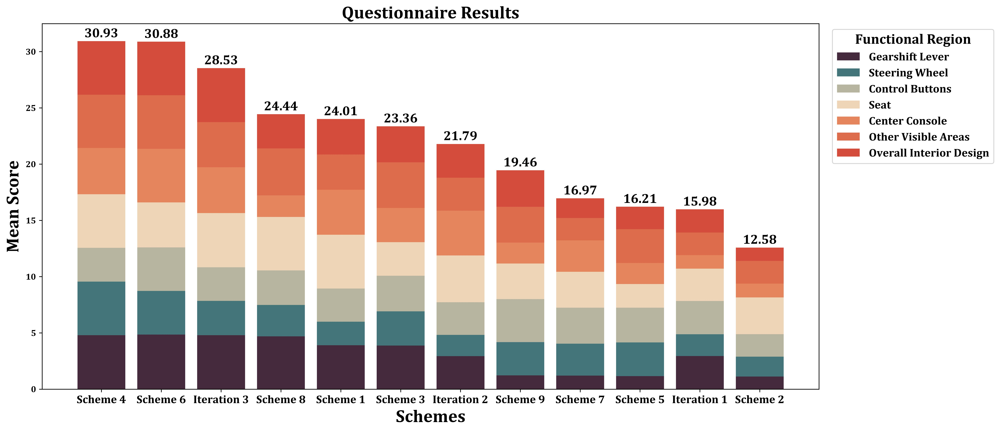
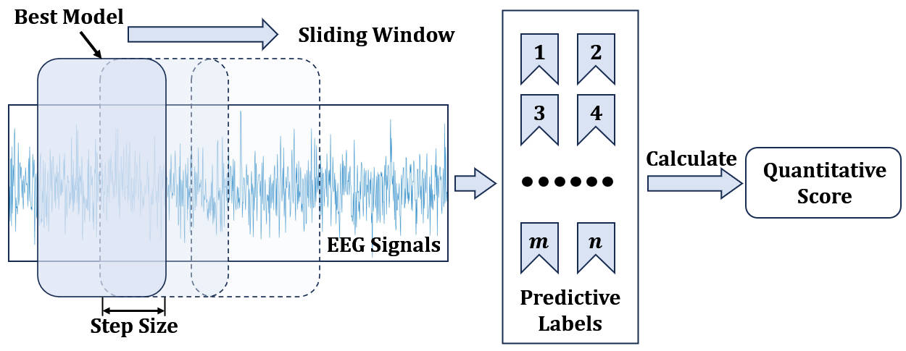

# Integrating Kansei Engineering with GenAI: A Retrieve-Prompt Enhanced Conceptual Design Framework via Imaginal Thinking
## Introduction
This work is based on our IJPR 2025 paper titled _**Integrating Kansei Engineering with GenAI: A Retrieve-Prompt Enhanced Conceptual Design Framework via Imaginal Thinking**_. By integrating Kansei Engineering with GenAI, we propose a retrieve-prompt strategy leveraging imaginal thinking to assist in product conceptual design. This approach realizes the iterative optimization of automotive interior image. Below, we detail the implementation process of our method.
## Dependencies
### Requirements:
Our code has been tested with:
- Python (version 3.11)
- TensorFlow (version 2.16)
- CUDA (version 11.4)
- Psychtoolbox (version 3.0.19)
- EEGLAB (version v 2023.1)

Ensure that all dependencies are correctly installed in your environment for smooth execution.
## Experimental flow
### 1. **Image Selection**
We selected 24 high-definition images of automotive interiors, which were divided into a **training set** and a **test set**. To minimize the impact of vehicle logos on interior design judgment, the logos were mosaiced.

- The partial images in the **training set** are available in the directory:  
  [Training Set Images](./data/TrainingSet)
  
- The images in the **test** set are available in the directory:  
  [Test Set Images](./data/TestSet)

### 2. **Design a Subjective Questionnaire**
We designed a 5-point Likert scale questionnaire to collect subjective feedback on the interior designs. The content of the questionnaire is shown below.

<div align="center">
  
</div>

To evaluate design images, the study recruited participants through both **online (randomly selected) and offline channels (comprising 80% university students and 20% local residents)** to ensure sample diversity. Participants were presented with these interior images in a randomized order to mitigate sequence effects and were asked to rate them using a Likert scale. Following data collection, invalid responses were discarded, and the mean scores were calculated to ensure data reliability for validating user feedback. **Each questionnaire involved the evaluation of 12 images, ultimately yielding 120 ± 10 valid scoring responses for each image.** The statistical scores of the questionnaire survey on the images are shown in the following figure.
<div align="center">
  
</div>

### 3. **Stimulus Flow Presentation**
The experiment utilized the **Psychtoolbox** in MATLAB to present images sequentially. The experimenter's emotional responses were induced by observing the content of the displayed images, while EEG signals were simultaneously recorded. The related code can be found in the file [VisualPresentation.m](./code/VisualPresentation.m).


<div align="center">
  
</div>

A total of 20 healthy participants (14 males, 6 females; mean age = 24.3 years) were recruited for this study. All participants were right-handed. They were enrolled in the 'Innovative Design Thinking and AI (IDT & AI)' course at Shanghai Jiao Tong University and possessed foundational knowledge of automotive interiors. **Since our experiment employed a user-centered iterative design process, each experimental session was conducted with a single participant at a time.** The detailed experiment scene is shown in the figure below. During the experiment, participants were instructed to maintain a comfortable seated position, remain relaxed, and minimize unnecessary body movements to reduce interference from physiological artifacts in the signal recordings.
<div align="center">
  
</div>

### 4. **Data Preprocessing and Training**

#### Data Preprocessing:
EEG data was collected from 34 channels, including: Fp1, Fp2, Af3, Af4, Fz, F3, F4, F7, F8, FC1, FC2, FC5, FC6, Cz, C3, C4, T7, T8, CP1, CP2, CP5, CP6, Pz, P3, P4, P7, P8, PO3, PO4, PO7, PO8, Oz, O1, O2. The channel location diagram is as follows.

<div align="center">
   
</div>


- **Filtering**: We applied band-pass filtering to the raw data and extracted relevant frequency band features.
- **Resampling**: Data was downsampled to 200Hz.
- **Segmentation**: EEG data was segmented into 3-second windows.

The related code uses **EEGLAB toolbox** in MATLAB and can be found in the file [Preprocess.m](./code/Preprocess.m).
#### Training:
We used deep convolutional networks, including deep separable convolution layers, to process the EEG data. The related code can be found in the [EEGCNN.py](./code/EEGCNN.py). The detailed model structure is shown below.

<div align="center">
  
</div>

The accuracy of this model in the emotion elicitation stage of the test set is shown in the figure below. You can see the confusion matrix and t-SNE visualizations of the model’s classification performance.

<div align="center">
   
</div>

- **Positive emotion** is represented in dark blue.
- **Neutral emotion** is represented in cyan blue.
- **Negative emotion** is represented in yellow.

The confusion matrix shows that positive emotions were harder to classify compared to neutral and negative emotions, as seen in the t-SNE visualization.
### 5. **Design evaluation: Quantization formula calculation.**
Guided by the Kansei Engineering, we propose the following quantization formula for design evaluation:

$$
Score=\sum_{i=1}^N{\left[ \left( \frac{\widetilde{M_i}}{\sum_{p=1}^N{M_p}} \right) \cdot \left( \frac{\alpha _i-\alpha _{i,\min}}{\alpha _{i,\max}-\alpha _{i,\min}} \right) \right]}+\widetilde{C}
$$

This formula calculates the score by integrating the EEG data from both the emotion elicitation and judgment stages, as well as the Likert scale feedback. In order to make the evaluation results of the formula more objective, the weights of the above three are set as **0.6**, **0.2** and **0.2** respectively.
The scores of each stage (emotion elicitation and judgment) were normalized using a sliding window, as shown below.
<div align="center">
  
</div>
Test set image detailed score calculation is shown in the figure below. The image of the car interior corresponding to the test set is visible in the folder.
<table border="0" cellpadding="0" cellspacing="0" width="590" style="border-collapse:collapse;table-layout:fixed;width:444pt">
  <col width="134" style="mso-width-source:userset;mso-width-alt:4778;width:101pt">
  <col width="106" style="mso-width-source:userset;mso-width-alt:3783;width:80pt">
  <col width="111" style="mso-width-source:userset;mso-width-alt:3953;width:83pt">
  <col width="110" style="mso-width-source:userset;mso-width-alt:3925;width:83pt">
  <col width="129" style="mso-width-source:userset;mso-width-alt:4579;width:97pt">
  <tr height="18" style="height:13.8pt">
    <td height="18" width="134" style="height:13.8pt;width:101pt">Scheme</td>
    <td width="106" style="width:80pt">a</td>
    <td width="111" style="width:83pt">b</td>
    <td width="110" style="width:83pt">c</td>
    <td width="129" style="width:97pt">score</td>
  </tr>
  <tr height="18" style="height:13.8pt">
    <td height="18" align="right" style="height:13.8pt">1</td>
    <td align="right">0.607</td>
    <td align="right">0.571</td>
    <td align="right">0.643</td>
    <td align="right">0.5926</td>
  </tr>
  <tr height="18" style="height:13.8pt">
    <td height="18" align="right" style="height:13.8pt">2</td>
    <td align="right">0.179</td>
    <td align="right">0</td>
    <td align="right">0</td>
    <td align="right">0.0358</td>
  </tr>
  <tr height="18" style="height:13.8pt">
    <td height="18" align="right" style="height:13.8pt">3</td>
    <td align="right">0.571</td>
    <td align="right">0.643</td>
    <td align="right">0.357</td>
    <td align="right">0.5714</td>
  </tr>
  <tr height="18" style="height:13.8pt">
    <td height="18" align="right" style="height:13.8pt">4</td>
    <td align="right">0.893</td>
    <td align="right">0.929</td>
    <td align="right">0.714</td>
    <td align="right">0.8788</td>
  </tr>
  <tr height="18" style="height:13.8pt">
    <td height="18" align="right" style="height:13.8pt">5</td>
    <td align="right">0.321</td>
    <td align="right">0.143</td>
    <td align="right">0.071</td>
    <td align="right">0.1642</td>
  </tr>
  <tr height="18" style="height:13.8pt">
    <td height="18" align="right" style="height:13.8pt">6</td>
    <td align="right">0.893</td>
    <td align="right">0.857</td>
    <td align="right">0.643</td>
    <td align="right">0.8214</td>
  </tr>
  <tr height="18" style="height:13.8pt">
    <td height="18" align="right" style="height:13.8pt">7</td>
    <td align="right">0.357</td>
    <td align="right">0.286</td>
    <td align="right">0.143</td>
    <td align="right">0.2716</td>
  </tr>
  <tr height="18" style="height:13.8pt">
    <td height="18" align="right" style="height:13.8pt">8</td>
    <td align="right">0.643</td>
    <td align="right">0.607</td>
    <td align="right">0.5</td>
    <td align="right">0.5928</td>
  </tr>
  <tr height="18" style="height:13.8pt">
    <td height="18" align="right" style="height:13.8pt">9</td>
    <td align="right">0.429</td>
    <td align="right">0.5</td>
    <td align="right">0.143</td>
    <td align="right">0.4144</td>
  </tr>
</table>

### 6. **Retrieve prompt generation**
The format for the retrieval prompt input to the Generative AI is:

``` 
< Customer need (Optimized region, Likert scale score); Functional requirement; Design evaluation (Scheme, EEG objective score) + Market trends >
```

- **Customer Need**: Identifies the area in the design needing improvement based on the lowest Likert scale score.
- **Functional Requirement**: Defines the criteria for image segmentation, based on common functional areas in automotive interiors.
- **Design Evaluation**: Uses the previously introduced quantization formula to score the design image results.
- **Market Trends**: Provides optimization suggestions based on current trends in automotive design.
### 7. Iterative optimization phase.
To generate optimized results, the following models were executed sequentially:
1. **Segment Anything Model (SAM)**: Used for image segmentation and region-of-interest extraction.
2. **Diffusion Model (DM)**: Applied for image generation, refining the design iteratively.
#### Installation and Usage

We utilized Generative AI models developed by other researchers. Detailed installation and usage instructions for each model can be found at the following links:

- 
- 

The detailed flow chart of iterative optimization of retrieval prompts for automotive interiors as shown below.
<div align="center">
  
</div>

#### Iteration Process

In this phase, the automobile interior image was iterated three times, with each iteration focused on specific areas and objectives. The search prompts for each iteration were as follows:
1. **Iteration 1:**
``` 
< (The gearshift lever, 1); Common functional areas; (Scheme2, 0.0358) + (Ergonomics, Aesthetics, Automatic transmission) >
```
2. **Iteration 2:**
``` 
< (The centre console, 1); Common functional areas; (Scheme2, 0.1284) + (Intelligent interaction, Multifunction) >
```
3. **Iteration 3:**
``` 
< (The overall interior, 3); Common functional areas; (Scheme2, 0.4932) + (Comfort, Luxury, Coordination) >
```
#### Model Functions

- **Segment Anything Model (SAM):** Extracts customer need and functional requirement in the retrieve prompt. We utilized [the ViT-H model](https://github.com/facebookresearch/segment-anything?tab=readme-ov-file) within SAM for image segmentation to extract the regions of interest.
- **Diffusion Model:** Extracts the constraints in the retrieve prompt. We used [the Stable-Diffusion-v1-5 model](https://huggingface.co/stable-diffusion-v1-5/stable-diffusion-v1-5) for iterative image generation, where each iteration refines the design based on the specific requirements and constraints extracted from the prompts.
#### Results
Each iteration generates a series of images, which can be found in the output folder. For each image, we apply a quantitative scoring formula to assess its quality. The generated images, along with their corresponding scores, reflect the results of each iteration and the refinement process based on the retrieve prompt.

The design images with the highest scores for each iteration are below.
<div align="center">
    
</div>

## Acknowledgments

The authors greatly appreciate the creators of the following models:
[Segment Anything Model](https://github.com/facebookresearch/segment-anything) by Kirillov et al and
[Stable Diffusion](https://github.com/CompVis/stable-diffusion) by Robin Rombach et al.
Their innovative work and contributions have been instrumental in the development of this project.

